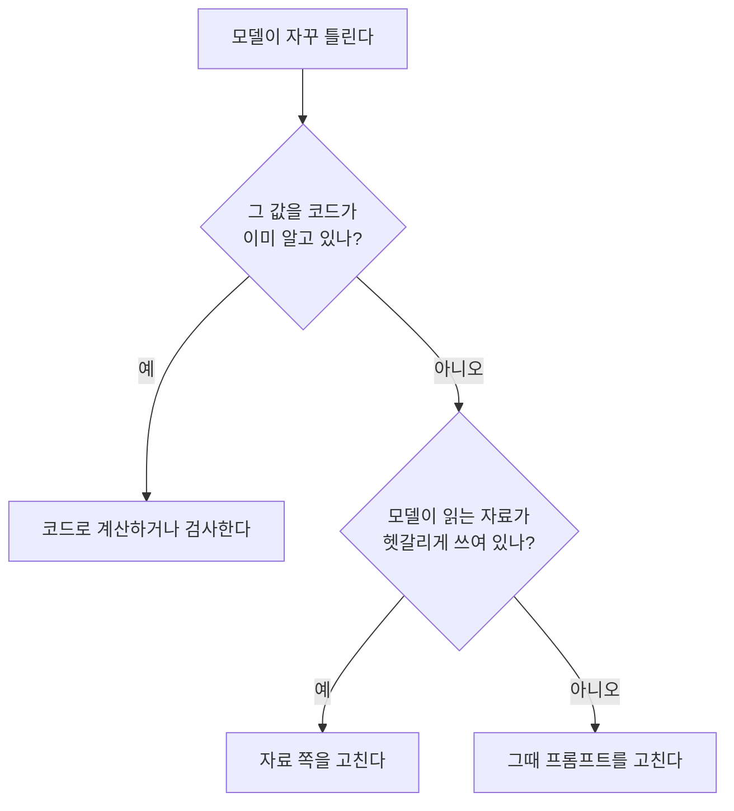
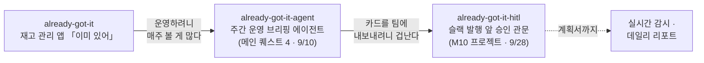
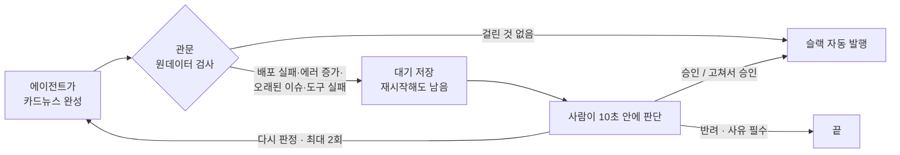

## 들어가며

9월 14일부터 29일까지 LangGraph로 에이전트 다섯 개를 만들었습니다. 강의 예제와 다르게 프로젝트마다 주제를 바꿨는데, 고른 이유는 제각각이었어요.

| 강의 예제 | 제가 만든 것 | 왜 이 주제였나 |
|---|---|---|
| AI 뉴스레터 | 문화·공간 브리핑 봇 「모두의 교양」 | **일중독에서 좀 벗어나 볼까** 하는 마음. AI 뉴스 대신 주말에 볼 거리를 받고 싶었어요 |
| 쇼핑몰 고객 응대 | 택배 중계 서비스 상담 에이전트 | **제 경력과 이어지는 분야**라 가장 이해하기 쉬웠어요 |
| 영화 추천 GraphRAG | 노벨 문학상 지식 그래프 | 도메인과 상관없이 **기술 확인** |
| 딥리서치 | 노벨 문학상 리서치 팀 | 위 자료를 넓혀서, 역시 **기술 확인** |
| 사람이 승인하는 에이전트 | 「이미 있어」 카드뉴스 발행 전 승인 관문 | **제 도메인.** 제 앱 운영 에이전트의 다음 단계 |

다 만들고 보니 가장 많이 반복한 건 **프롬프트로 부탁하던 걸 결국 코드로 옮긴 일**이었어요. 1장은 그 이야기, 2장은 에이전트 바깥에서 쓴 시간, 3장은 평가, 4장은 제 앱에서 이어진 세 프로젝트를 **지난 회고의 규칙으로 다시 채점하고 앞으로 쓸 곳**을 정리했습니다.

---

## 1. 가장 많이 반복한 일: 부탁을 장치로 옮기기

지난번 하네스 글에 **"지시문은 부탁이고, 코드는 장치"** 라고 썼는데, 이번 모듈에서 이 문장을 몇 번이고 다시 확인했어요.

| 어디서 | 프롬프트로 부탁했을 때 | 코드로 옮긴 뒤 |
|---|---|---|
| 뉴스레터 | "~합니다체로 써 줘" → 자꾸 안 지켜짐 | 존댓말 검사 함수 + 어기면 다시 요청 |
| 뉴스레터 | 모델이 "문화/공간" 묶음 칸을 자주 비움 → `문화 0/3 · 공간 0/2` | 묶음은 **코드가 주제에서 계산** → `공간 4 · 문화 1` |
| 딥리서치 | 작품명 《》과 근거 표시 «»를 섞어 씀 → 근거율 **0%** | 근거는 따로 칸으로 받고 «»는 코드가 붙임 → **74%** |
| 승인 관문 | 카드 문장에 "추정"이 있으면 멈추기 | 도구가 가져온 **원데이터**로 판정 |

그래서 이제는 이 순서로 생각해요.

### "사과 되나요?" 한 문장에 제일 오래 걸렸습니다

택배 상담 에이전트에 "사과 되나요?"라고 물었더니 **"사과는 예약 취소 후 가능합니다"** 라는, 어디에도 없는 규정을 지어냈어요. 원인은 매뉴얼 10장 제목 **"사과와 조치 권한"** 이었어요. 모델이 과일 사과를 **사죄**로 읽은 거죠. 제가 "사죄의 사과야, 과일 사과야?"라고 묻고 나서야 보였습니다.

프롬프트에 규칙을 넣어 봤지만 세 번 다 실패했고, 오히려 다른 질문의 분류 정확도가 0.881에서 0.810으로 떨어졌어요. 해결은 매뉴얼 제목을 **"유감 표명과 조치 권한"** 으로 바꾸고, 취급 제한 물품을 실제 목록으로 채운 거였어요. 프롬프트가 아니라 **모델이 읽는 자료를 고쳐야** 했던 겁니다.

뉴스레터에서도 영화 소개에 "러닝타임 100분"을 지어냈는데, 알고 보니 제 편집 지침에 "러닝타임을 적을 것"이 있었어요. 조건을 붙여도 계속 지어내서 결국 **그 단어를 지웠습니다.** 덤으로 남은 문장도 하나 있어요. **"금지는 금지 목록에 적어야 읽힌다."**

---

## 2. 시간을 가장 많이 먹은 곳은 에이전트 바깥이었습니다

솔직히 에이전트 로직보다 **바깥과 연결하는 데** 시간이 더 들었어요.

- **공공데이터 전시 API** — 403, 옛 주소 폐기, 2024년에 멈춘 36건짜리를 거쳐 겨우 569건을 확보했더니, GitHub 서버에서는 국내 API에 접속이 안 됐어요.
- **LLM 비용과 한도** — OpenAI 크레딧 소진 → 로컬 모델은 한 건에 50초 → Gemini 무료는 하루 20건.
- **멈춘 채로 12시간** — 모델이 끝없이 생성하는데 글자 수 상한도, 대기 시간 제한도 없었어요.
- **위키백과** — 너무 자주 요청해서 최대 49초씩 막혔어요.

그래서 이제 **처음부터 거는 세 가지**가 있어요. 외부 호출에는 **대기 시간 제한**, 모델 호출에는 **생성 길이 상한**, 한 번 받은 자료는 **저장해 두고 다시 쓰기.** 시간 제한이 없는 호출은 에러를 내지 않고 **그냥 조용히 멈춰 있어요.** 지난 회고에서 무섭다고 쓴 "조용한 실패"가 이번엔 12시간짜리였습니다.

---

## 3. 평가: 자를 먼저 만들고, 그 자도 의심하기

**자를 먼저 만든다.** 고객 응대에서는 코드를 쓰기 전에 시험용 문의부터 떼어 뒀어요. 그 자로 재 보니 키워드 규칙 0.677, LLM 분류 0.948이었고, 제가 제안한 "정의 문장 넓히기 + 모든 분류에 골고루 예시" 조합이 **0.987**로 가장 높았어요. **범위를 넓히는 건 정의로, 두 분류를 가르는 건 예시로** 하는 게 맞았습니다.

**좋은 방법도 모든 질문에 좋지는 않다.** GraphRAG는 여러 단계를 잇는 추천 질문에서 0.35를 0.80으로 올렸지만, 단순한 질문에서는 1.00에서 0.83으로 떨어졌어요.

**지표가 이겨도 사람은 다르게 본다.** 딥리서치에서 혼자 하는 에이전트와 팀 에이전트를 비교하니 지표로는 팀이 모두 앞섰는데, 나란히 읽어 보니 어떤 질문에서는 **"팀 쪽은 성의가 부족해 보인다"** 는 게 제 판단이었어요. 숫자 옆에 사람이 읽는 칸이 하나 필요합니다.

---

## 4. 제 도메인으로 이어진 세 프로젝트

마지막 프로젝트는 따로 떨어진 과제가 아니라, 제 앱에서 시작해 한 줄로 이어진 세 번째 저장소예요.

가진 물건을 까먹고 또 사는 걸 막는 앱을 만들었고, 그 앱의 배포·지표·이슈·보안 권고를 읽어 매주 카드뉴스를 만드는 에이전트를 붙였어요([지난 회고](/posts/main-quest-4-retrospective/)). 이번에는 그 카드뉴스를 슬랙 `#ops-brief`에 올리는 단계를 붙이고, **그 바로 앞에 사람을 세웠습니다.** 슬랙 웹훅으로 보낸 메시지는 **지울 수 없어서** 여기가 되돌릴 수 없는 한 곳이었거든요.

### 4-1. 왜 사람이 필요한가 — 가게 영수증 비유

점장이 영수증 200건을 전부 보면 점장이 쓰러지고, 직원에게 다 맡기면 정확도가 99%여도 하루 2건은 틀린 채 나갑니다. 그래서 "애매하면 **결재판에 올려**"라는 규칙을 둬요. 이걸 코드로 만든 게 **interrupt**(결재판 올리고 손 멈추기)와 **체크포인터**(어디까지 했는지 적는 메모장)예요.

함정도 있었어요. 메모장에는 "어느 칸에서 멈췄는지"만 적혀서, 다시 시작하면 **멈춘 노드가 첫 줄부터 다시 돌아요.** 강의 예제에서 "검토 중" 문자가 두 통 나갔고, 문자 보내는 부분을 노드로 떼어 내자 한 통이 됐어요. 제 프로젝트는 Claude Agent SDK라 개념만 옮겼어요. 에이전트가 끝난 뒤 **루프 밖에서** 판정하고, 멈춘 건은 `publish.json`에 적어 두니 서버를 껐다 켜도 대기 건이 남습니다.

### 4-2. 제일 오래 걸린 건 "언제 멈출지" 정하는 일

기준을 다섯 번 바꿨어요.

| 단계 | 기준 | 결과 |
|---|---|---|
| 1 | 카드 문장에 "추정"이 있거나 근거 번호가 없으면 멈춤 | 제가 붙인 정답과 9편 중 **5편만** 일치 |
| 2 | "확인 못 함"이 있으면 멈춤 | 9편 중 8편이 멈춤 → **전부 멈추는 것과 같음** |
| 3 | 원데이터로 판정: 배포 실패, 에러 증가, 7일 넘은 이슈 | 9편 모두 맞음. **하지만 기준을 만든 자료로 채점한 것** |
| 4 | 처음 보는 4편으로 시험 | 1편 놓침 → **"도구 실패"** 조건 추가 |
| 5 | 기준 수정에 한 번도 안 쓴 4편으로 확인 | 놓침 0, 괜히 멈춤 1 |

방향을 바꾼 건 3단계였어요. 제가 정답을 붙일 때 본 건 **"카드에 뭐라고 쓰여 있나"가 아니라 "그 주에 실제로 무슨 일이 있었나"** 였거든요. 놓침과 괜히 멈춤 중에는 **"놓침이 더 비싸"** 가 제 답이었어요. 괜히 멈추면 제가 10초 보면 되지만, 놓치면 틀린 카드가 팀 채널에 올라가니까요.

승인 화면에는 왜 멈췄는지, 그 근거, 승인하면 무엇이 올라가는지 세 칸만 뒀어요. 자동 발행 한 건과 승인 후 발행 한 건을 실제 슬랙 채널로 보내 확인했습니다.

### 4-3. 지난 회고를 이번 프로젝트에 적용해 보니

지난 회고 끝에 적은 **"다음 퀘스트의 작업 규칙"** 을 하나씩 채점해 봤어요.

| 지난 회고에서 정한 것 | 이번에 어떻게 됐나 | |
|---|---|---|
| 화면 리뷰는 한 바퀴 몰아서 | 고칠 점을 목록 하나로 모아 한 번에 요청 | ✅ |
| 모르는 것을 0으로 적지 않는다 | 승인 기준까지 넓어짐. 도구가 자료를 못 가져오면 그 자체가 멈출 이유 | ✅ |
| 결정 기록 · 픽스처로 재현 | 결정 기록을 이어 쓰고, 검증용 픽스처 6개를 새로 만듦 | ✅ |
| "확인 못 했다"를 그대로 말하기 | 보고서에 한계 11줄, 승인 버튼을 누가 눌렀는지까지 밝힘 | ✅ |
| 화면 파일 300줄 넘기지 않기 | 1,220줄 → 733줄. 아직 넘음 | 🔺 |
| 「표시 규약」을 먼저 채우고 시작 | 칸은 채워져 있었는데, 새 화면을 만들 때 **대조하지 않아서** 한글 버튼·`—`·한국 시간이 아닌 시각이 또 나옴 | 🔺 |
| 토큰 권한 확인 | 읽기 권한이 없어 실제 데이터가 **매주 멈춤.** 권한을 두 번 추가하고서야 해결 | ❌ |

제일 뜨끔한 건 표시 규약이에요. 지난번엔 "다짐 대신 **문서 칸**을 만들면 비어 있는 게 보인다"고 썼는데, 칸이 채워져 있어도 **안 보고 만들면 소용없었어요.** 규약 문서도 결국 **저에게 하는 부탁**이었던 거죠. 그래서 다음에는 장치로 바꾸려고 해요. 화면 글자에 `—`가 있으면 실패하는 테스트, 시각은 표시 함수 하나로만, 실행 전 권한을 한 번씩 호출해 보는 사전 점검.

그래도 토큰 문제는 이번엔 **조용히 숨지 않았어요.** 관문이 매주 "도구 실패"로 멈춰 선 덕에 금방 드러났거든요. "모르는 걸 0으로 적지 않기"가 제 실수를 잡아 준 셈입니다.

### 4-4. 앞으로 쓸 수 있는 곳

**이 프로젝트의 다음 단계**로 5~15분마다 도는 **실시간 감시**와 매일 아침 **데일리 리포트**를 계획서로 써 뒀어요. 감지는 모델 없이 규칙으로, 사람은 되돌릴 수 없는 곳 앞에만, 헛알림은 처음부터 센다는 원칙을 이번 프로젝트에서 그대로 가져왔어요. 가장 큰 숙제는 아직 배포를 안 해서 **5분마다 돌 자리가 없다**는 거예요.

**다른 분야로 옮긴다면**, 이번에 만든 틀은 "되돌릴 수 없는 한 곳 앞에, 원데이터로 계산한 기준을 두고, 놓침과 괜히 멈춤으로 잰다"예요.

| 분야 | 되돌릴 수 없는 순간 | 원데이터로 세울 기준 예시 |
|---|---|---|
| 뉴스레터 자동 발행 | 구독자에게 발송 | 검수 탈락 기사, 출처 접근 실패, 묶음별 쿼터 미달 |
| 고객 상담 | 고객에게 금액·기간 안내 | 가드레일 위반, 같은 사안을 세 번 되물음 |
| 보고서 인용 검증 | 보고서 제출 | 근거를 못 찾은 각주, 출처 파일 없음 |
| 서비스 운영 | 운영 배포, 공개 이슈 등록 | 테스트 실패, 에러 증가, 보안 권고 해당 버전 |

옮길 때 조심할 것도 두 가지예요. **사람 판단도 흔들려요.** 신호가 똑같은 두 주를 제가 한 번은 "안 봐도 됨", 한 번은 "봐야 함"으로 갈랐어요. 기준보다 먼저 제 판단 원칙을 문장으로 적어 둬야 해요. 그리고 **너무 자주 멈추면 버튼만 누르게 돼요.** 새로 돌린 9편 중 8편이 멈췄으니, 몇 주 더 쌓아서 괜히 멈춤을 줄여야 합니다.

---

## 마치며

두 주 동안 에이전트 다섯 개를 만들면서 남은 걸 네 줄로 줄이면 이렇습니다.

1. **모델이 자꾸 틀리면, 부탁하기 전에 코드와 자료부터 봅니다.**
2. **점수가 좋게 나오면 자부터 의심합니다.** 기준을 만든 자료로 잰 점수는 증거가 아니에요.
3. **바깥에 닿는 호출에는 처음부터 시간 제한을 겁니다.**
4. **제가 저에게 쓴 규칙도 부탁입니다.** 지켜야 하는 건 검사로 만들어 둡니다.

재고 관리 앱 하나에서 시작한 게 운영 에이전트가 되고, 사람이 승인하는 관문이 됐어요. 다음은 실시간 감시예요. 그때는 네 번째 줄부터 확인하고 시작해야겠어요.
